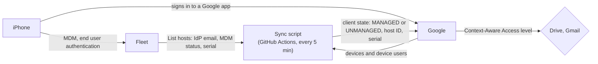

# Google conditional access for iPhones: test results (fleetdm/fleet#55107)

Live test of the draft guide "Conditional access: Google" ([PR #55107](https://github.com/fleetdm/fleet/pull/55107)) and its sync
script, on a real iPhone, for a customer request. Google Context-Aware Access lets only Fleet-managed iPhones and iPads into Google
apps. Built-in support is coming in [#54888](https://github.com/fleetdm/fleet/issues/54888).

**Result: works, with fixes.** As written, the script's first write fails, the GitHub Action fails, and the access level never
lets the managed iPhone in. With the fixes, the managed iPhone signs in, an iPhone or account Fleet doesn't count is blocked, and
access follows Fleet both ways within seconds of a sync.

| The request | Result | Evidence |
|---|---|---|
| Follow the guide with a test iPhone and a test OU | Done. Three parts fail as written: script (HTTP 400), workflow (HTTP 400), access level condition (never matches) | [C-1a](EVIDENCE.md#c-1a-the-pr-55107-sync-script-as-written-against-the-real-iphone), [G-7](EVIDENCE.md#g-7-the-sync-as-a-github-action), [C-1c](EVIDENCE.md#c-1c-does-the-access-level-read-the-fleet-client-state) |
| A Fleet-managed iPhone can sign in | **Yes**, with the keyless condition | [C-1e](EVIDENCE.md#c-1e-keyless-exists-condition-lets-the-fleet-managed-iphone-in), [E-2b](EVIDENCE.md#e-2b-fleets-idp-email-decides-access-end-to-end-managed-guard-blocked-back) |
| An iPhone not in Fleet is blocked | **Yes**: an account Fleet never marked, and a phone Fleet stops counting (blocked within seconds) | [C-2](EVIDENCE.md#c-2-a-user-fleet-never-marked-is-blocked-on-the-same-iphone), [E-2b](EVIDENCE.md#e-2b-fleets-idp-email-decides-access-end-to-end-managed-guard-blocked-back) |
| Report what worked and update the guide | 34 findings; guide and script fixed on a branch for review | [GUIDE-FINDINGS.md](GUIDE-FINDINGS.md), [`proposed/`](proposed) |

## How it works



The script matches Google's iPhones to Fleet hosts by the end user's IdP email and device type (Google has no serial numbers for
iPhones), and writes a client state under the partner ID `<customer-ID-without-C>-fleet`. The access level that works:

```
device.vendors.exists(k, device.vendors[k].is_managed_device == true)
```

## What changed (branch `adam/google-conditional-access-guide-tested`)
- **Access level:** the keyless condition above; no `device.vendors["<key>"]` form matched on iOS (7 tried).
- **Script:** partner ID without the C and `customers/my_customer`; gets its own Google token from the service account key;
  IdP email only and no BYOD by default; serial number as the asset tag; whole-state writes (with `updateMask`, Google appends to
  `assetTags`); "No email" flags; stops instead of unmanaging everyone when Fleet returns no emails.
- **Workflow:** no auth action (it returned HTTP 400), its own secret for the Fleet API token, a note that GitHub can delay schedules.
- **Guide:** how to check a sync, Admin Console left out of the assignment, what end users see, troubleshooting from real errors.

## Not tested, and open
- Apple Business (ADE) enrollment with end user authentication on the iPhone: the IdP email was set on the host by API, which
  Fleet reports as the same `mdm_idp_accounts` source. iPads, BYOD, and Gmail (the test domain has no MX records).
- A delegated admin that isn't a super admin for domain-wide delegation.
- For Google: the `device.vendors` key for a customer-owned client state, so the condition can name Fleet.
- GitHub's 5-minute schedule: in this repo scheduled runs start hours late (Duo too), so all syncs in the tests were started by hand.

## Files
| File or folder | What it is |
|---|---|
| [EVIDENCE.md](EVIDENCE.md) | Every test with its result, pictures and links to the raw output (generated) |
| [RESULTS.md](RESULTS.md) | One line per test |
| [GUIDE-FINDINGS.md](GUIDE-FINDINGS.md) | Every finding, in guide order, and whether the branch fixes it |
| [TESTING-LOG.md](TESTING-LOG.md) | Everything tried, in order, with times |
| [TEST_PLAN.md](TEST_PLAN.md) | The tests and how they pass |
| [RUNBOOK.md](RUNBOOK.md) | How to run the loop again (managed, guard, blocked, back) |
| [NOTES.md](NOTES.md) | How the lab differs from production |
| [`proposed/`](proposed) | The branch diff against #55107, and the guide and script as proposed |
| [`scripts/`](scripts) | Lab helpers used in the tests |
| `test-evidence/` | `desk/`, `fleet/`, `cloud/`, `admin-console/`, `iphone/`, `github/`: raw output and window screenshots |

Lab: Fleet 4.92.3 (`fleet.mpc.ad`, fleet "iOS Google Lab", `../../fleets/ios-google-lab/`), Google Workspace Enterprise Standard
trial on a lab domain, test OU "Fleet iOS test", one iPhone 15 Pro Max on iOS 26.6.1, Google Drive. Workflow:
`../../.github/workflows/google-sync.yml`. Method: `../_framework`.
